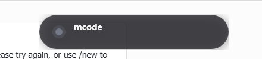
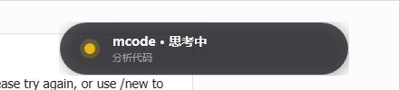
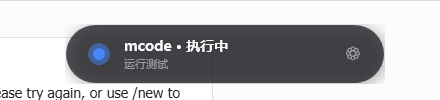
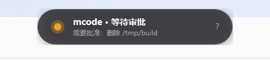
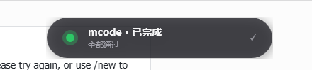
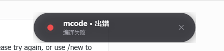

# mcode-island

A Windows desktop **Dynamic Island** for MiniMax Code agents. A small pill anchored to the
top center of your primary display mirrors the agent's working state in real time
(`idle` / `thinking` / `working` / `waiting` / `done` / `error`). You can leave
the terminal in the background and still see exactly what your agent is doing.

## Demo

| idle | thinking | working | waiting | done | error |
|:----:|:--------:|:-------:|:-------:|:----:|:-----:|
|  |  |  |  |  |  |

The pill is a single 320×60 WPF window, always-on-top, click-to-focus. The
widget polls `%APPDATA%\mcode-island\status.json` every 400 ms; the agent (or a
thin wrapper) just writes JSON to that file.

## What problem this solves

While the agent works on a long task (compile, install, test, refactor) the user
often switches away from the terminal to read code, check docs, browse the web.
There is no visible progress signal. The agent may also be paused on a
permission prompt or have failed silently. `mcode-island` makes all of that
visible at a glance, without forcing the user to switch back.

## Copyable example

### One-line install and run

```cmd
:: 1. install the plugin into your mcode plugins directory
::    (the location printed by `mcode config` for `plugin_dir`)
set PLUGIN_DIR=%USERPROFILE%\.minimax\plugins
if not exist "%PLUGIN_DIR%\mcode-island" mkdir "%PLUGIN_DIR%\mcode-island"
xcopy /E /I "%~dp0" "%PLUGIN_DIR%\mcode-island"

:: 2. start the widget
"%PLUGIN_DIR%\mcode-island\mcode-island.cmd" start
```

### From a MiniMax Code session

Ask the agent to read a large file. The agent's `read` invocation triggers
two state pushes — `working` while the tool runs, `done` when it returns:

```text
> read C:\path\to\very-large-file.cs and summarize the public API

[widget pulses blue: ⚙ working — read: very-large-file.cs]
[widget goes green: ✓ done — read: very-large-file.cs]
```

If the file does not exist:

```text
> read C:\path\to\missing.cs

[widget pulses blue: ⚙ working — read: missing.cs]
[widget goes red: ✕ error — read: missing.cs]
```

### Wrap every bash call (recommended for power users)

The shipped `wrap-tool.ps1` is a one-stop wrapper: it pushes `working` before
the command, then `done` / `error` / `waiting` based on `$LASTEXITCODE`, all
without changing the command's exit code:

```powershell
& "%PLUGIN_DIR%\mcode-island\wrap-tool.ps1" `
    -Tool bash -Command "npm test" -Description "run tests"
```

## Quick start

1. **Install** — copy this folder into your `~/.minimax/plugins/mcode-island/`
   (or any directory you want; the scripts only need to live together).
2. **Start the widget**:
   ```cmd
   mcode-island.cmd start
   ```
   You should see a small dark pill appear at the top center of the screen.
3. **Test a state push** from a new terminal:
   ```powershell
   & "%PLUGIN_DIR%\mcode-island\notify-island.ps1" -State working -Message "demo"
   ```
   The pill should turn blue and pulse for as long as you don't push another state.
4. **Enable logon auto-start** (optional):
   ```powershell
   & "%PLUGIN_DIR%\mcode-island\autostart.ps1" -Enable
   ```
   This writes to `HKCU\Software\Microsoft\Windows\CurrentVersion\Run`. No
   admin rights required.
5. **Stop when done**:
   ```cmd
   mcode-island.cmd stop
   ```

## What is in this package

```
mcode-island/
├── plugin.json                    # plugin manifest (official 1.0 schema)
├── README.md                      # this file
├── LICENSE                        # Apache-2.0
├── mcode-island.ps1               # WPF widget main loop
├── mcode-island.cmd               # CLI shim: start/stop/status/show/pin/...
├── start-island.ps1               # launcher (forces STA + hidden console)
├── stop-island.ps1                # stop the widget
├── status-island.ps1              # print widget PID + recent log
├── show-island.ps1                # re-raise hidden widget
├── pin-island.ps1                 # lock click-to-focus target
├── autostart.ps1                  # register / unregister Windows logon
├── notify-island.ps1              # state-push helper (agents call this)
├── wrap-tool.ps1                  # all-in-one bash wrapper
├── skills/mcode-island/SKILL.md   # Skill consumed by the agent
└── assets/                        # screenshots embedded above
```

The whole package is a single portable directory. No installer, no native
binary, no symlink, no `node_modules`.

## Requirements

| requirement       | version / note                                        |
| ----------------- | ----------------------------------------------------- |
| Windows           | 10 1809+ or 11 (uses WPF, `user32` `kernel32`)        |
| PowerShell        | 5.1 (ships with Windows 10/11) or PowerShell 7        |
| .NET WPF runtime  | 4.x (ships with Windows 10/11)                        |
| execution policy  | `Bypass` for this directory; not changed globally    |
| network access    | **none** — widget does not make any network request  |
| accounts          | **none**                                              |
| paid services     | **none**                                              |

## Data use

| data             | location                              | lifetime                  | purpose                              |
| ---------------- | ------------------------------------- | ------------------------- | ------------------------------------ |
| `status.json`    | `%APPDATA%\mcode-island\`             | rewritten every transition | widget polling                       |
| `caller.json`    | `%APPDATA%\mcode-island\`             | rewritten every transition | click-to-focus target HWND           |
| `config.json`    | `%APPDATA%\mcode-island\`             | rewritten on drag         | pill position, size, opacity         |
| `widget.pid`     | `%APPDATA%\mcode-island\`             | rewritten on start        | widget process PID                   |
| `island.log`     | `%APPDATA%\mcode-island\`             | append-only, never pruned  | state transition history             |
| `widget.log`     | `%APPDATA%\mcode-island\`             | append-only, never pruned  | widget internal debug                |
| `show.signal`    | `%APPDATA%\mcode-island\`             | transient                 | "raise hidden window" signal        |
| `HKCU\...\Run`   | Windows registry                      | until disabled            | logon auto-start                     |

**No data leaves the local machine. No telemetry. No network requests.**

## CLI reference

```cmd
mcode-island                REM start the widget (no-op if already running)
mcode-island stop           REM stop the widget
mcode-island status         REM show widget PID, session, last 5 log lines
mcode-island show           REM re-raise a hidden widget
mcode-island pin            REM lock click-to-focus target to current foreground
mcode-island unpin          REM clear focus target
mcode-island autostart-on   REM register for Windows logon
mcode-island autostart-off  REM unregister
```

The `mcode-island` command is the `.cmd` shim. The Skill tells the agent to call
`notify-island.ps1` directly, not the shim, because PowerShell agents can
invoke `.ps1` more easily than `.cmd`.

## How click-to-focus works

When the agent calls `notify-island.ps1`, the helper probes the process chain
for an attached console window, and falls back to the first ancestor with a
`MainWindowHandle`. The discovered HWND / PID is written to `caller.json`. When
the user clicks the pill, the widget uses `SetForegroundWindow` on that HWND.

If the auto-detected HWND is wrong (common on Windows Terminal with multiple
tabs), run `mcode-island pin` from inside the tab you want to return to. The
CLI grabs the foreground window *before* the widget steals focus, so this is
the most reliable fix.

The widget is also intentionally hard to kill. Alt+F4 sends `WM_CLOSE`, which
the widget intercepts in `WndProc` and treats as Hide rather than Close. To
re-raise the hidden window: `mcode-island show`. To kill it for real:
`mcode-island stop`.

## Test evidence

This plugin has been exercised on Windows 11 24H2 with PowerShell 5.1, against
a live MiniMax Code session. Empirical evidence (captured during development):

- 59 state transitions recorded in `island.log` over a multi-hour session
  (21 `working` / 14 `done` / 11 `idle` / 6 `waiting` / 5 `thinking` / 1 `error`).
- All 6 states screenshot-verified (`assets/state-*.png`).
- Full state-machine demo (`assets/demo-*.png`): `thinking` → `working` →
  `waiting` → `working` → `done` on a real `bash npm test` run.
- Click-to-focus round-trip verified: from a Feishu tab, click the pill, focus
  jumps to the originating Windows Terminal tab (HWND consistent).
- `wrap-tool.ps1` exit-code semantics: 0 → `done`, 1 → `waiting` (default;
  configurable via `-WaitingExitCodes`), other → `error`.

## Limitations

- Windows only. The widget uses WPF, `user32`, and `kernel32` P/Invoke.
- One widget per user session.
- `wrap-tool.ps1` only wraps `bash`. Other tools need direct
  `notify-island.ps1` calls.
- The widget does not show a progress percentage, token usage, or per-tool
  output. v0.2 will.
- File-system polling at 400 ms is not the most efficient design (FileSystemWatcher
  was unstable inside WPF in our tests), but it is robust against any kind of
  writer and never misses an event.

## Roadmap

v0.2 — Tauri (Rust + WebView) rewrite for richer UI, hover-expand, click-through,
       per-step progress, media-control integration.
v0.3 — Multi-tab awareness, terminal-agnostic focus restore.

## License

Apache-2.0. See [LICENSE](LICENSE).
